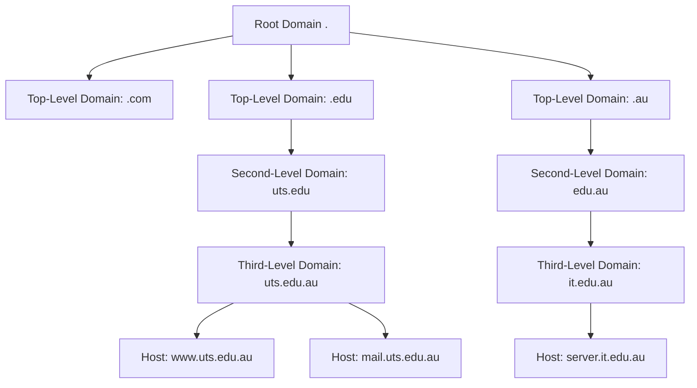

## 1. OSI 7-Layer Network Model

### Layer Structure (Bottom to Top)

**[[Physical Layer]] (#1)**

- Hardware and [[interface]] cards
- Physical transmission medium

**[[Data]] [[Link Layer]] (#2)**

- Hardware/[[interface]] card device drivers
- [[MAC address]] handling

**[[Network Layer]] (#3)**

- **[[IP]] (Internet Protocol)**: [[Data]] packet [[routing]]
- **ICMP (Internet Control Message Protocol)**: ping, error messages

**[[Transport Layer]] (#4)**

- **TCP (Transmission Control Protocol)**: Error-correcting connections (email)
- **[[UDP]] (User Datagram Protocol)**: No order guarantee, no error correction (audio streaming)

**Session Layer (#5) & Presentation Layer (#6)**

- [[Session management]] and [[data]] presentation

**[[Application Layer]] (#7) - Highest Layer**

- **Protocols**: [[FTP]], Telnet, rlogin, SSH, [[SMTP]]
- User-facing applications and services

---

## 2. Network Addresses

### 2.1 [[Data]] [[Link Layer]] - MAC Addresses

**MAC (Media Access Control)**

- **Format**: 6 bytes, e.g., `00:A0:CC:24:BA:02`
- **Structure**:
    - First half: Company ID (Organizationally Unique Identifier)
    - Second half: Product ID (device-specific)

**Command**: `ifconfig` to view MAC addresses

### 2.2 [[Network Layer]] - IPv4 Addresses

**Structure**: 4 bytes (32 bits)

- **Components**: Network Portion (NP) + Host Portion (HP)
- **Definition**: Network Mask determines NP vs HP division

**Example**: `192.168.3.3/24`

```
Network Mask: 255.255.255.0
Network portion: 24 bits (11111111 11111111 11111111)
Host portion: 8 bits (00000000)
```

**Private [[IP]] Address Ranges**:

- `10.0.0.0` to `10.255.255.255` (10.0.0.0/8)
- `172.16.0.0` to `172.31.255.255` (172.16.0.0/12)
- `192.168.0.0` to `192.168.255.255` (192.168.0.0/16)

**Characteristics**:

- Can be used freely in private networks
- Cannot be routed over Internet
- Excluded from [[public access]] filtering

**Public [[IP]] Addresses**:

- Allocated by IANA (Internet Assigned Numbers Authority)
- Delegated to regional centers and ISPs
- Globally routable addresses

### 2.3 [[Network Address Translation]] ([[NAT]])

**[[Function]]**: Translates private [[IP]] addresses to public [[IP]] addresses before external transmission

### 2.4 IPv6 Addresses

**Structure**: 16 bytes (128 bits) = 8 16-bit segments

- **Purpose**: Larger address space
- **Types**: Unicast, multicast, broadcast

### 2.5 Broadcast Communication

**Definition**: Send message/packet to all devices on network

- **Logical [[IP]]**: 192.168.255.255
- **Test command**: `ping -b 192.168.255.255`

---

## 3. Network Configuration Methods

### 3.1 Transient Configuration (Legacy - ifconfig)

**[[Interface]] Configuration**:

```bash
ifconfig ens37                                    # Show interface info
ifconfig ens33 192.168.168.64 netmask 255.255.255.0  # Set IP/netmask
ifconfig ens33 hw ether xx:xx:xx:xx:xx:xx        # Configure MAC
```

**[[Routing]] Configuration**:

```bash
route                                             # Show routes
route -n                                          # Show routes (numeric)
route del default gw xxx.xxx.xxx.xxx            # Delete default gateway
route add default gw xxx.xxx.xxx.xxx            # Add default gateway
route add -net 192.168.1.0 netmask 255.255.255.0 dev eth37  # Add route
```

### 3.2 Transient Configuration (Modern - ip utility)

**[[IP Address]] Management**:

```bash
ip a; ip addr; ip addr show                      # Show IP addresses
ip -4 addr                                       # Show IPv4 only
ip addr show dev ens33                           # Show specific interface
ip addr add 192.168.0.10/24 dev ens33          # Add IP address
```

**Link Management**:

```bash
ip link show                                     # Show all interfaces
ip link show ens33                               # Show specific interface
ip link set ens33 down                          # Bring interface down
ip link set ens33 up                            # Bring interface up
```

**Routing Management**:

```bash
ip route                                         # Show routing table
ip route add 192.168.0.10/24 dev ens33 metric 100  # Add route
ip route delete 192.168.0.10/24 dev ens33       # Delete route
```

### 3.3 NetworkManager (NM) - Default Service

**Service Management**:

```bash
systemctl {is-active|restart|start|enable} NetworkManager
```

**Key Features**:

- Keep network devices and connections active when available
- Create temporary connections for connectivity without config files
- Provide GUI, TUI, and CLI tools

**Tools Available**:

- **GUI**: `nm-connection-editor`, GNOME
- **TUI**: `nmtui` (NetworkManager Text User Interface)
- **CLI**: `nmcli` (command-line interface)

### 3.4 NetworkManager TUI (nmtui)

**Usage**:

```bash
nmtui                                            # Launch text menu
nmtui hostname                                   # Set hostname directly
nmtui edit ens33                                 # Edit specific interface
nmtui connect ens33                              # Bring interface up
```

**Navigation**: Tab, Shift+Tab, Enter, Space

### 3.5 NetworkManager CLI (nmcli)

**Syntax**: `nmcli [OPTIONS] OBJECT [COMMAND] [ARGUMENTS...]`

**Connection Management**:

```bash
# Create static connection
nmcli con add type ethernet ifname ens37 ipv4.addresses '192.168.1.100/24' ipv4.gateway 192.168.1.1 ipv4.method manual

# Create dynamic connection
nmcli c add type ethernet ens33 ifname ens33 ipv4.method auto

# Modify connection
nmcli c modify ens37 ipv4.addr '192.168.1.200'

# Control connections
nmcli c up ens37                                 # Activate connection
nmcli c down ens37                               # Deactivate connection
nmcli c delete ens37                             # Delete connection

# View connections
nmcli c show                                     # List all connections
nmcli c show ens33 | grep address               # Show specific details
```

**Device Management**:

```bash
nmcli dev; nmcli d                               # Show device list
nmcli d status                                   # Show device status
nmcli d show ens33                               # Detailed device info
nmcli d connect ens33                            # Activate NIC
nmcli d disconnect ens33                         # Disconnect device
```

**Device States**:

- **Connected**: Managed by NM, active connection
- **Disconnected**: Managed by NM, no active connection
- **Unmanaged**: Not managed by NM
- **Unavailable**: Cannot be managed by NM

---

## 4. Persistent Network Configuration

### 4.1 Configuration Files

**System-wide Configuration** (deprecated in CentOS 8):

- `/etc/sysconfig/network`

**Interface-specific Configuration**:

- `/etc/sysconfig/network-scripts/ifcfg-xxx`

**DNS Configuration**:

- `/etc/resolv.conf` (auto-generated by NetworkManager)

### 4.2 Sample Interface Configuration (ifcfg-ens37)

```
BOOTPROTO=none                    # none: manual, dhcp: DHCP
NAME=ens37                        # Connection name
DEVICE=ens37                      # Physical device
ONBOOT=yes                        # Start at boot
IPADDR=192.168.1.10              # IP address
NETMASK=255.255.255.0            # Network mask (or PREFIX=24)
GATEWAY=192.168.1.1              # Default gateway
DNS1=1.1.1.1                     # Primary DNS
DNS2=2.2.2.2                     # Secondary DNS
DOMAIN=google.com.au             # Domain suffix
```

### 4.3 DNS Configuration (/etc/resolv.conf)

```
# Generated by NetworkManager
search google.com.au mydomain     # Domain search list
nameserver 1.1.1.1               # Primary DNS server
nameserver 2.2.2.2               # Secondary DNS server
```

### 4.4 Recommended Configuration Steps

**Method 1 (Highly Recommended)**:

```bash
# 1. Edit configuration file
vim /etc/sysconfig/network-scripts/ifcfg-ens37

# 2. Reload configuration
nmcli c reload ens37

# 3. Activate interface
nmcli c up ens37
```

**Method 2 (Legacy)**:

```bash
# 1. Edit configuration file
vim /etc/sysconfig/network-scripts/ifcfg-ens37

# 2. Restart interface
ifdown ens37
ifup ens37
```

---

## 5. Hostname Configuration

### 5.1 Hostname Types

**Static Hostname**:

- Traditional hostname stored in `/etc/hostname`
- Persistent across reboots

**Pretty Hostname**:

- Free-form UTF-8 hostname for user presentation
- Can contain spaces and special characters

**Transient Hostname**:

- Dynamic hostname maintained by kernel
- Default: localhost
- Can be changed by DHCP or mDNS at runtime

### 5.2 Hostname Management

**Transient Change**:

```bash
hostname hostname.example.com     # Temporary change
```

**nmcli Method**:

```bash
nmcli general hostname            # Query current hostname
nmcli general hostname localhost.localdomain  # Set hostname (effective instantly)
```

**hostnamectl Method**:

```bash
hostnamectl status                # Query all hostname types
hostnamectl set-hostname localhost.localdomain  # Set static hostname
```

**Manual Configuration**:

```bash
# Edit /etc/hostname file
vim /etc/hostname

# Apply changes
systemctl restart NetworkManager
# OR
systemctl restart systemd-hostnamed
# OR reboot
```

### 5.3 DNS Setup Recommendation

**Single NIC Setup**:

```bash
# 1. Set hostname
hostnamectl set-hostname myhostname.mydomain

# 2. Configure interface
vim /etc/sysconfig/network-scripts/ifcfg-ens37

# 3. Reload and activate
nmcli c reload ens37
nmcli c up ens37
```

---

## 6. Firewall Management

### 6.1 iptables

**Purpose**: Provide IPv4/IPv6 [[firewall]] between LAN and Internet

**Features**:

- Packet filtering with ordered rules
- First match terminates search
- Default policy for unmatched packets
- Match criteria: source/dest IP, ports, protocol, state

**Functions**:

- **[[IP]] Masquerading ([[NAT]])**: Rewrite [[IP]] headers for Internet access from private [[IPs]]
- **Packet Filtering**: Rule-based traffic control

### 6.2 firewalld

**Relationship**: firewalld acts as front-end to iptables back-end

**Key Differences**:

- **firewalld**: Can update rules while running, zone-based approach
- **iptables**: Static rules, requires restart for changes

**Default Behavior**:

- **firewalld**: Drops all traffic, selectively allows specific traffic
- **iptables**: Blocks incoming, allows outgoing

**Zones** (9 predefined zones):

- block, work, [[home]], public, trusted, drop, DMZ, internal, external
- Configuration: `/usr/lib/firewalld/zones`

**Management Tools**:

- **CLI**: `firewall-cmd`
- **GUI**: `firewall-config`
- **Direct**: Modify XML files

**Commands**:

```bash
# Installation and service management
yum install firewalld firewall-config
systemctl start|stop|restart|enable|disable firewalld

# Basic operations
firewall-cmd --state                          # Check status
firewall-cmd --zone=public --add-port=80/[[tcp]] --permanent  # Open port
```

---

## 7. System [[Time Management]]

### 7.1 Time Concepts

**Unix Time**: Seconds since January 1, 1970, 00:00:00 UTC (Unix epoch)

**Time Standards**:

- **GMT**: Greenwich Mean Time
- **UTC**: Universal Time Coordinated (same as GMT)

**Commands**:

```bash
date                              # Display current local time
date -u                           # Display UTC time
```

### 7.2 Timezone Management

**View Current Timezone**:

```bash
ls -l /etc/localtime             # Show timezone symlink
```

**Change Timezone**:

```bash
# Remove existing link and create new one
rm /etc/localtime
ln -s /usr/share/zoneinfo/Australia/Sydney /etc/localtime
```

### 7.3 Time Configuration Tools

**Legacy Method (date command)**:

```bash
date +"%A, %B %d %Y"             # Custom format display
date MMDDhhmm[[CC]YY][.ss]       # Set date/time
date 12101430                    # Set to Dec 10, 14:30
```

**Hardware Clock**:

```bash
hwclock                          # Display hardware clock
```

**Modern Method (timedatectl)**:

```bash
timedatectl                      # Display time information
timedatectl set-time "2021-08-20 06:15:00"  # Set date and time
timedatectl set-ntp 0            # Disable NTP
timedatectl set-ntp yes          # Enable NTP (starts chronyd)
```

### 7.4 Network Time Protocol (NTP)

**Purpose**: Synchronize clocks over Internet networks

**Architecture**:

- Client-server model
- Clock stratum scheme (0-15, 0 = most accurate)
- Compensates for network packet travel time

**Traditional NTP Setup**:

```bash
# Install NTP
yum install ntp

# Start service
systemctl start ntpd

# Synchronize time (CentOS 6)
ntpdate time.uts.edu.au
```

### 7.5 Chrony Daemon (Modern NTP)

**Advantages over traditional NTP**:

- Faster synchronization
- Better accuracy on busy networks
- Maintains accuracy during network downtime

**Configuration**:

- **Config file**: `/etc/chrony.conf`
- **Service**: `chronyd`

**Commands**:

```bash
# Service management
systemctl start chronyd

# Monitoring and control
chronyc sources -v               # Check time sources
chronyc sourcestats              # Time server statistics
chronyc add server time.uts.edu.au  # Add NTP server
chronyc tracking                 # View software clock info
chronyc makestep                 # Force time synchronization
```

---

## Key Protocols and Concepts

**[[DHCP]]**: Dynamic Host Configuration Protocol - Automatic [[IP]] assignment **[[DNS]]**: Domain Name System - Domain name to [[IP address]] resolution **FQDN**: Fully Qualified Domain Name - Complete domain name (host.example.com) **UTF-8**: Unicode Transformation Format - Character encoding system **NTP**: Network Time Protocol - Network time synchronization

---

## Lab Environment Notes

**Virtual Interfaces in Labs**:

- **ens33**: First virtual network [[interface]]
- **ens37**: Second virtual network [[interface]]
- **vmnet2**: Private network 10.0.2.0/24 - 10.0.2.254/24
- **vmnet8**: Private network 192.168.3.0/24 - 192.168.3.254/24

## 1. Lab 3 Recapture - Network Setup Overview

### Network Topology

**VM Configuration**:

- Each VM has two virtual interfaces: `ens33` and `ens37`
- **vmnet2**: Private network `10.0.2.0/24` - `10.0.2.254/24`
- **vmnet8**: Private network `192.168.3.0/24` - `192.168.3.254/24`

**Host Configuration**:

- **Subnet-1** (1st network card): `IP: 192.168.3.1`
- **Subnet-2** (2nd network card): `IP: 192.168.3.2`, `Ethernet 1: IP: 10.0.2.2`

### Command-line Configuration Tasks

**Temporary Network Setting**:

```bash
ifconfig ens37 10.0.2.1 255.255.255.0        # Set IP and netmask
route add default gw 10.0.2.1                # Set default gateway
```

**Connectivity Testing**:

- Linux VM → Host laptop/PC ping test
- Host PC → `ens33` and `ens37` ping tests

### Persistent Network Configuration

**Dynamic Interface (ens33)**:

```bash
vim /etc/sysconfig/network-scripts/ifcfg-ens33
```

```
BOOTPROTO=dhcp          # Dynamic IP assignment
DEFROUTE=yes           # Use as default route (assigned by DHCP)
ONBOOT=yes             # Enable interface at boot
```

**Static Interface (ens37)**:

```bash
vim /etc/sysconfig/network-scripts/ifcfg-ens37
```

```
DEVICE=ens37           # Physical device name
NAME=ens37             # Connection name
BOOTPROTO=none         # Static configuration
IPADDR=10.0.2.1        # Static IP address
NETMASK=255.255.255.0  # Subnet mask
DEFROUTE=no            # Not default route
ONBOOT=yes             # Enable at boot
GATEWAY=10.0.2.1       # Gateway address
DNS1=1.1.1.1           # Primary DNS
DNS2=2.2.2.2           # Secondary DNS
DOMAIN=google.com.au   # Domain suffix
```

**Interface Management**:

```bash
nmcli con down/up ens37        # Restart connection
ifdown/up ens37               # Alternative method
```

---

## 2. Hostname Configuration

### Temporary Hostname Change

```bash
nmcli general hostname host.uts.edu.au
```

### Persistent Hostname Change

**Method 1**:

```bash
# Step 1: Modify hostname file
vim /etc/hostname

# Step 2: Update hosts file
vim /etc/hosts

# Step 3: Restart network service
systemctl restart network
```

**Method 2**:

```bash
hostnamectl set-hostname host.uts.edu.au    # Updates /etc/hostname automatically
```

---

## 3. DHCP Introduction

### Purpose

**Dynamic Host Configuration Protocol (DHCP)** reduces network complexity and administration overhead.

### Problem with Static Configuration

- **Manual configuration**: Required for each machine individually
- **Scalability issue**: How to manage 10,000+ machines?
- **Administrative burden**: Time-consuming and error-prone

### DHCP Solution

**Automatic Configuration**:

- Clients automatically obtain network configuration from DHCP server
- **Protocol**: Uses [[UDP]] ports 67 (server) and 68 (client)
- **Communication**: Network broadcasts on local subnet (255.255.255.255)

**Broadcast Definition**: IP address 255.255.255.255 allows any host to send packets to every node on the local network.

---

## 4. Address Allocation Methods

### Dynamic IP Configuration

**IP Address Pools**:

- Allocate "lease" IP addresses from pool of available addresses
- **Pools/Scopes**: Named collections of IP address ranges
- **Lease characteristics**:
    - Tied to specific adapter [[MAC address]]
    - Time-limited duration
    - Changes over time

### [[IP Address]] Reservation

**Static Assignment within [[DHCP]]**:

- "Reserve" specific [[IP]] address for particular hosts
- **Use cases**: Servers, printers, critical infrastructure
- **Benefits**: Combines [[DHCP]] management with static addressing

### [[DHCP]] [[Database]] Structure

```
IP Address1: Leased to DHCP Client1 (Generation)
IP Address2: Leased to DHCP Client2 (Renewal)
IP Address3: Available to be leased
```

**Lease Types**:

- **Lease Generation**: Request new lease
- **Lease Renewal**: Extend existing lease

---

## 5. [[DHCP]] Operations

### 5.1 [[DHCP]] Lease Generation (DORA [[Process]])

**4-Step [[Process]]**:

**Step 1: DHCPDISCOVER**

- **Action**: [[DHCP]] client broadcasts DHCPDISCOVER packet
- **Scope**: Broadcast to entire [[subnet]]
- **Response**: Only [[DHCP]] servers or agents respond

**Step 2: DHCPOFFER**

- **Action**: [[DHCP]] servers broadcast DHCPOFFER packets
- **Content**: Potential [[IP]] address lease information
- **Multiple servers**: Client may receive multiple offers

**Step 3: DHCPREQUEST**

- **Action**: Client broadcasts DHCPREQUEST packet
- **Selection**: Usually chooses fastest responding server (typically closest)
- **Content**: Contains server identifier indicating chosen server
- **Notification**: Informs all servers of selection [[decision]]

**Step 4: DHCPACK/DHCPNAK**

- **DHCPACK**: Chosen server stores client info in [[database]] and confirms lease
- **DHCPNAK**: Sent if server cannot provide offered address
- **Declined servers**: Use DHCPREQUEST as notification of rejection

### 5.2 [[DHCP]] Lease Renewal [[Process]]

**Renewal Timeline**:

**50% of Lease Duration**:

- Client sends DHCPREQUEST to original server
- Server responds with DHCPACK to extend lease

**87.5% of Lease Duration**:

- If renewal fails at 50%, [[process]] repeats
- Last chance to renew with original server

**100% of Lease Duration (Lease Expiry)**:

- If renewal fails at 87.5%, full DORA [[process]] restarts
- Client broadcasts DHCPDISCOVER to find any available server

---

## 6. [[DHCP]] Scopes and Reservations

### [[DHCP]] Scopes

**Definition**: Range of [[IP]] addresses available for leasing to specific network segments

**Multi-[[subnet]] Environment**:

```
LAN A ← DHCP Server → LAN B
      ↓         ↓
   Scope A   Scope B
```

**Scope Configuration**: Each LAN segment gets its own IP address range

### DHCP Reservations

**Purpose**: Guarantee specific IP address for particular client

**Use Cases**:

- **Servers**: Require consistent IP addresses
- **Printers**: Need fixed addresses for user access
- **Network infrastructure**: Switches, routers, access points

**Implementation Process**:

1. Open DHCP Server role
2. Expand DHCP scope → click Reservations
3. Click More Actions → New Reservation
4. **Requirement**: Must obtain device's MAC address

### DHCP High Availability (80:20 Rule)

**Fault Tolerance Configuration**:

```
Scope: 192.168.1.10 – 192.168.1.254
(Reserve .1 - .9 for servers)

DHCP Server1: 80% of addresses (192.168.1.60 - 192.168.1.254)
DHCP Server2: 20% of addresses (192.168.1.10 - 192.168.1.59)
```

**Benefits**:

- Increased availability
- Load distribution
- Fault tolerance

---

## 7. DHCP Server Implementation (Linux)

### 7.1 Installation and Setup

**Package Installation**:

```bash
yum install dhcp-server            # Install DHCP server package
```

**Service Management**:

```bash
systemctl status dhcpd             # Check DHCP service status
systemctl {start|restart|enable} dhcpd  # Control DHCP service
```

**Configuration Files**:

```bash
rpm -qc dhcp-server               # List configuration files
```

### 7.2 Global Configuration (/etc/dhcp/dhcpd.conf)

**Copy Example Configuration**:

```bash
cp /usr/share/doc/dhcp-server/dhcpd.conf.example /etc/dhcp/dhcpd.conf
```

**Global Options Example**:

```bash
# Global options for all networks
option domain-name "example.org";
option domain-name-servers ns1.example.org, ns2.example.org, 8.8.8.8;
default-lease-time 600;           # 10 minutes
max-lease-time 7200;              # 2 hours
```

### 7.3 Subnet Configuration

**Individual Subnet Setup**:

```bash
subnet 10.5.5.0 netmask 255.255.255.224 {
    range 10.5.5.26 10.5.5.30;                    # IP range for leasing
    option domain-name-servers ns1.internal.example.org;
    option domain-name "internal.example.org";
    option routers 10.5.5.1;                      # Default gateway
    option broadcast-address 10.5.5.31;           # Broadcast address
    default-lease-time 600;                       # 10 minutes
    max-lease-time 7200;                          # 2 hours
}
```

**Host Reservation Example**:

```bash
host fantasia {
    hardware ethernet 08:00:07:26:c0:a5;         # MAC address
    fixed-address 10.5.5.10;                     # Reserved IP
    option domain-name-servers 8.8.8.8;          # Custom DNS
}
```

### 7.4 DHCP Server Operations

**Firewall Configuration**:

```bash
firewall-cmd --add-service=dhcp --permanent      # Allow DHCP through firewall
firewall-cmd --reload                             # Apply firewall changes
```

**Logging and Debugging**:

```bash
/var/log/messages                                 # Check system logs for errors
```

**Client Testing (Linux)**:

```bash
dhclient -d                                       # Run DHCP client in debug mode
ip a                                              # Check assigned IP addresses
```

**Client Testing (Windows)**:

```cmd
ipconfig /renew                                   # Request new lease
ipconfig /release                                 # Release current lease
ipconfig /all                                     # Show all network configuration
```

---

## 8. Network Configuration Summary

### Windows Configuration Requirements

- **IP address and subnet mask**
- **Default gateway**
- **DNS server addresses**
- **DNS suffix/search domain**
- **Hostname**

### Linux Configuration Files

**Interface Configuration**:

- `/etc/sysconfig/network-scripts/ifcfg-ens33` (DHCP interface)

**System Configuration**:

- `/etc/hostname` (hostname configuration)
- `/etc/resolv.conf` (DNS configuration - auto-generated)

### Network Verification Commands

**IP Address Check**:

```bash
ip a                                              # Show all interfaces and IPs
```

**Gateway Check**:

```bash
ip route                                          # Show routing table
```

**DNS Check**:

```bash
cat /etc/resolv.conf                             # Show DNS configuration
```

**Hostname Check**:

```bash
hostname                                          # Show current hostname
```

### Hostname Configuration Methods

**Method 1 (Manual)**:

```bash
vim /etc/hostname                                # Edit hostname file
hostnamectl set-hostname myhostname.mydomain    # Apply changes
```

**Method 2 (Automatic)**:

```bash
hostnamectl set-hostname myhostname.mydomain    # Updates /etc/hostname automatically
```

### Domain Resolution Configuration

**Adding domain to /etc/resolv.conf** (3 methods):

1. **Manual edit**: Direct file modification
2. **DHCP option**: Configure via DHCP server
3. **resolvectl**: Use systemd-resolved utility

---

## Interface Configuration Template

### Static Interface Configuration (ifcfg-ens37)

```bash
TYPE=Ethernet                     # Interface type
BOOTPROTO=none                    # Static configuration (none) vs DHCP (dhcp)
NAME=ens37                        # Connection name (usually same as DEVICE)
DEVICE=ens37                      # Physical device name
UUID=9a5b99db-9450-44c5-aece-fbfb20f28e7d  # Can be deleted
ONBOOT=yes                        # Enable at boot
IPADDR=10.0.2.1                   # Static IP address
NETMASK=255.255.255.0             # Subnet mask (alternatively: PREFIX=24)
GATEWAY=10.0.2.1                  # Default gateway
DNS1=1.1.1.1                      # Primary DNS server
DNS2=2.2.2.2                      # Secondary DNS server
DOMAIN=google.com.au              # DNS search domain
```

### Applying Configuration Changes

```bash
vim /etc/sysconfig/network-scripts/ifcfg-ens37  # Edit configuration
nmcli c reload ens37                             # Reload configuration
nmcli c up ens37                                # Activate [[interface]]
```

---

## Key Concepts Summary

1. **[[DHCP]] eliminates manual [[IP]] configuration** through automated lease management
2. **DORA [[process]]** (Discover, Offer, Request, Acknowledge) handles [[IP]] assignment
3. **Lease renewal** occurs at 50% and 87.5% of lease duration
4. **Scopes define [[IP]] ranges** for different network segments
5. **Reservations provide static [[IPs]]** within [[DHCP]] framework
6. **High [[availability]]** achieved through multiple [[DHCP]] servers (80:20 rule)
7. **Configuration files** enable persistent network settings
8. **Proper testing and verification** essential for network functionality

---

## Week 5 Skills Assessment Preparation

### Topics to [[Review]]

- **Basic networking setup** (static + dynamic configuration)
- **Configuration steps, files, and commands**
- **Testing procedures and expected results**
- **Using blank VMs**: CentOS Stream 8 and [[Windows]] Server 2019

### Required Preparation

1. Download empty *.ova files
2. Import them as *.vmx files before Week 5 assessment
3. [[Review]] announcements from 14/8/2025 and 18/8/2025


# Domain Name System




## 1. Introduction

- **IP address** = numeric label of a host
    
- **Domain names** = hostname + domain (e.g., `www.uts.edu.au`)
    
- **FQDN (Fully Qualified Domain Name):** `hostname.domain` (e.g., `mymail.uts.edu.au`)
    
- IP can change, but domain name stays the same → useful for web hosting & customer retention
    
- **ICANN:** manages DNS, IP addressing, protocols
    
    - **IANA** (Internet Assigned Numbers Authority) handles registries for domain names, IPs, and parameters
        

---

## 2. Before DNS

- **HOSTS.TXT** – central file of hostname → IP mappings (downloaded periodically)
    
- Not scalable → replaced by DNS
    
- Still exists locally:
    
    - Unix/Linux: `/etc/hosts`
        
    - Windows: `C:\Windows\System32\drivers\etc\hosts`
        

Example:

`127.0.0.1   localhost.localdomain localhost 192.168.1.1 fang.cats.org fang 192.168.1.2 moggy.cats.org moggy`

---

## 3. DNS Namespace (Hierarchy)

- Structured like an **inverted tree**
    
- **Root domain**: `.` (maintained by 12 organizations: Verisign, ICANN, RIPE, etc.)
    
- **Top-Level Domains (TLDs):**
    
    - Generic: `.com`, `.org`, `.gov`, `.edu`, `.biz`, `.info`, `.tv`, etc.
        
    - Country code: `.au`, `.uk`, `.us`, `.nz`, etc.
        
- **Second-Level domains:** `edu.au`, `uts.edu.au`
    
- **Third/Fourth level domains:** `it.uts.edu.au`, `ns.it.uts.edu.au`
    

---

## 4. Basic DNS Concepts

DNS provides multiple functions via different record types:

1. **A / AAAA** – maps hostname → IPv4 / IPv6 address
    
2. **CNAME** – alias name (e.g., `ftp.example.com` → `www.example.com`)
    
3. **NS** – identifies authoritative name servers for a domain
    
4. **MX** – mail server records for email routing
    
5. **TXT** – text data, often used for verification (e.g., SPF, DKIM)
    
6. **SRV** – service location (e.g., SIP, LDAP)
    
7. **SOA (Start of Authority):** admin info for domain (email, last update, serial, refresh, retry, TTL)
    
8. **PTR (reverse lookup):** maps IP → domain
    

---

## 5. DNS Roles and Caching

- **Primary (Master) DNS:** authoritative, holds the zone file
    
- **Secondary (Slave) DNS:** copies zone file for redundancy & performance
    
- **Caching-only DNS:** stores results temporarily (commonly at ISPs)
    
    - **TTL (Time to Live):** defines how long cached data is valid
        

---

## 6. DNS Lookup Process

- Resolver queries DNS servers iteratively until it finds an IP for the requested domain.
    
- Uses caching to reduce repeated lookups.
    

---

## 7. DNS Software: BIND

- **BIND (Berkeley Internet Name Daemon):** most common DNS server implementation
    
    - Installed via `yum install bind` or `dnf install bind`
        
    - Service name: `named` (the name daemon)
        
- Query tools:
    
    - `dig` (preferred) – flexible DNS lookup
        
    - `nslookup` – older, legacy
        
    - `host` – simpler queries
        

Examples:

`nslookup www.uts.edu.au dig uts.edu.au ns dig www.uts.edu.au a dig @ns.uts.edu.au www.uts.edu.au any`

---

## 8. BIND Server Configuration

### Step 1: `/etc/named.conf`

Defines zones and points to zone files. Example:

`zone "it.netserv.edu.au" {     type master;   # options: master, slave, forward, hint     file "it.netserv.edu.au.zone"; };`

### Step 2: Zone File (`/var/named/it.netserv.edu.au.zone`)

`$TTL 3H @   IN SOA ns.it.netserv.edu.au. root.it.netserv.edu.au. (         2025050101 ; serial (yyyymmddxx)         1D         ; refresh         1H         ; retry         1W         ; expire         3H )       ; minimum TTL     IN NS   ns.it.netserv.edu.au.     IN MX   0 mail localhost   IN A   10.0.2.3 ns          IN A   10.0.2.3 site        IN A   10.0.2.3 www         IN CNAME site ftp         IN CNAME site mail        IN CNAME site`

- **SOA record** defines authoritative server & refresh timings.
    
- **MX preference value** ranks mail servers (lower value = higher priority).
    

---

## 9. Reverse Zone Configuration

- Reverse lookup maps IP → hostname using **PTR records**.
    

Example (`/var/named/2.0.10.in-addr.arpa.zone`):

`$TTL 3H @   IN SOA ns.it.netserv.edu.au. root@it.netserv.edu.au. (         2025050100         1D         1H         1W         3H )     IN NS ns.it.netserv.edu.au. 2   IN PTR site.netserv.edu.au. 3   IN PTR site.it.netserv.edu.au.`

- Here, `10.0.2.2` → `site.netserv.edu.au`, `10.0.2.3` → `site.it.netserv.edu.au`
    

---

## 10. DNS Clients

- Config file: `/etc/resolv.conf`
    

`search it.uts.edu.au uts.edu.au nameserver 10.0.2.2 nameserver 10.0.2.3`

- Order of resolution defined in `/etc/nsswitch.conf`
    

Example:

`hosts: files dns myhostname`

- Local file `/etc/hosts` checked first, then DNS
    

---

## 11. Client Configuration

### Traditional (not recommended)

- Manual edits to `/etc/resolv.conf`
    
- Disable auto-config in `/etc/NetworkManager/NetworkManager.conf`
    

### Using `nmcli`

`nmcli con mod ens37 ipv4.dns "10.0.2.2 10.0.2.3" nmcli con up ens37`

### Recommended (NetworkManager config files)

- Interface config file: `/etc/sysconfig/network-scripts/ifcfg-ens37`
    

`DEVICE=ens37 ONBOOT=yes BOOTPROTO=none IPADDR=10.0.2.3 NETMASK=255.255.255.0 GATEWAY=10.0.2.3 DNS1=1.1.1.1 DNS2=8.8.8.8 DOMAIN=google.com.au PEERDNS=no IPV4_DNS_PRIORITY=10`

- `/etc/resolv.conf` then auto-generated:
    

`search google.com.au mydomain nameserver 1.1.1.1 nameserver 8.8.8.8`


